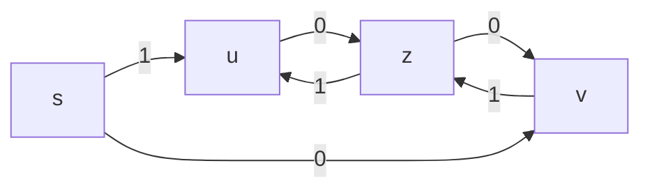

# Классификация по Хомскому
Ниже маленькие буквы - цепочки, а большие - нетерминалы, `t` - терминал.
* Класс 0 - грамматика с фразовой структорой. Обладает правилами вида `x->y`.
* Класс 1 - контекстно-чувствительная грамматика. Обладает правилами вида `pUq->puq`. То есть `U` можно заменить на `u` только в контексте `pq`.
* Класс 2 - контекстно-свободная грамматика. Обладает правилами вида `U->u`.
* Класс 3 - регулярные. Обладает правилами вида `U->t` и `U->Qt`. Этот класс широко используется для описания синтаксиса лексических единиц.

## Регулярные грамматики
### Диаграммы состояний
По регулярной грамматике можно построить диаграмму состояний, то есть ориентированный граф, в котором каждый нетерминал представлен узлом или состоянием, дополнительно добавляется начальное состояние S.
Для каждого правила `U->t` мы добавляем стрелку из вершины `S` в `U` по ребру `t`.
Для каждого правила `U->Qt` мы добавляем стрелку из вершины `Q` в `U` по ребру `t`.

Пример:
```
z->u0|v1
u->z1|1
v->z0|0
```


По графу легко понять формирование предложений: из S ходим п графу и формируем предложение из рёбер.
1. Грамматический разбор начинаем с S. Для очередного символа строки отыскиваем дугу, переходим в новое состояние.
2. Если дуга не найдена, это ошибка.
3. По концу разбора строки должны находиться в состоянии, соответствующему начальному символу грамматики(который не `S`)

Пример разбора используя граф выше:
```
S 010110
V 10110
z 0110
v 110
z 10
u 0
z <- success!!!
```

В случае если грамматика содержит правила `U->λ` или `U->Qλ`, то в диаграмме появляются ветви помеченные лямбдой.
Они должны быть удалены по следующим правилам:
1. Если `U` - заключительное состояние, то `Q` тоже помечаем как заключительное состояние.
2. В дополнение к каждой ветви из `U` в состояние `Pi` помеченной `ti` добавляется ветвь из `Q` в `Pi` и помеченное `ti`.
3. Ветвь помеченную лямбдой удаляем.


## Обработка числовых констант и их перевод в машинное представление
Предположим, что допустим формат констант:
```
<целое>[.[<целое>]][E[+|-]<целое>]
\--F--/
\--------P-------/
\----------Q--------/
\---------------Y--------/
\-----------------------X--------/

F->ц|Fц, где ц - цифра
P->F.|Pц
Q->PE|FE
Y->Q|Q+|Q-
X->Yц|Xц
Z->F|P|X
```
P.S. Тут мы ещё граф нарисовал для этого примера, но он большой, поэтому ну нафиг.

P.S.P.S. В лабораторных не стирайте дуги с лямбдами, а зачёркивайте!

Диаграмма состояний может быть представлена в виде матрицы MxN, где M - кол-во состояний, а N - кол-во терминалов.

Aij - номер состояния, куда переходим из состояния №i по терминалу №j.

Пример для грамматики числа:
|    | ц | . | E | + | - |
|:--:|:-:|:-:|:-:|:-:|:-:|
| 1S | 2 |   |   |   |   |
| 2F | 2 | 3 | 4 |   |   |
| 3P | 3 |   | 4 |   |   |
| 4Q | 6 |   |   | 5 | 5 |
| 5Y | 6 |   |   |   |   |
| 6X | 6 |   |   |   |   |

Одновременно с анализом правильности написания констант выполняется её перевод в машинное представление.
Это делается с помощью набора подпрограмм, которые вызываются перед переходом из одного состояния в другое.

Пример: `8.92E-10`
```
    m = 892 - мантиса
    n = 2   - кол-во цифр после запятой
    p = 10  - значение порядка
    s = -1  - знак порядка

    number = m * 10**(s*p - n)
```
Эти штуки можно собирать нашими подпрограммами.
Номера подпрограмм можно заносить в матрицу подпрограмм.
Матрица подпрограмм - то же, что и матрица состояний, но хранит подпрограммы.

|   | ц | . | E | + | - |
|:-:|:-:|:-:|:-:|:-:|:-:|
| S | 1 |   |   |   |   |
| F | 1 |   |   |   |   |
| P | 2 |   |   |   |   |
| Q | 4 |   |   |   | 3 |
| Y | 4 |   |   |   |   |
| X | 4 |   |   |   |   |

Подпрограммы:
1. m=10*m+d
2. m=10*m+d; n++
3. s=-1
4. p=10*p+d

Используя эти две таблицы мы можем записать разбор в виде таблицы:

|состояние|символ|подпрограмма|результат|новое состояние|
|:-------:|:----:|:----------:|:-------:|:-------------:|
| S       | 8    | 1          | m=8     | F             |
| F       | .    |            |         | P             |
| P       | 9    | 2          |m=89;n=1 | P             |
| P       | 2    | 2          |m=892;n=2| P             |
| P       | E    |            |         | Q             |
| Q       | -    | 3          | s=-1    | Y             |
| Y       | 1    | 4          | p=1     | X             |
| X       | 0    | 4          | p=10    | X             |

Итого: 
m=892; n=2; s=-1; p=10
number = 892 * 10**(s*p-n)
