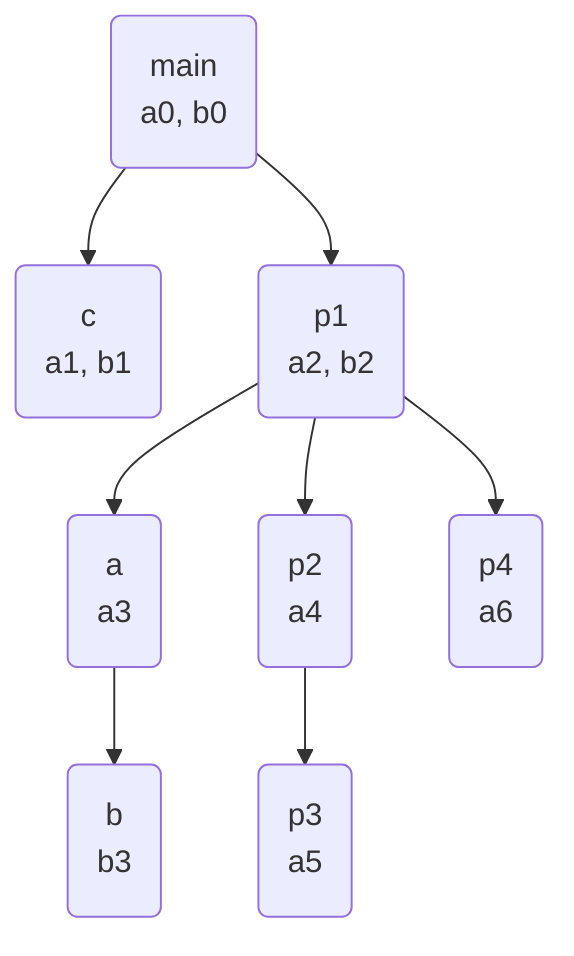
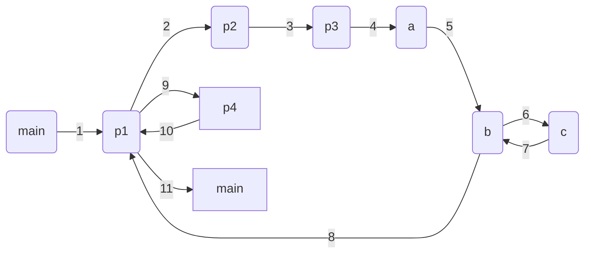

# Динамическое распределение памяти для данных.

При динамическом распределении, на этапе компиляции память распределяется только внутри блоков относительно начала области данных блока.
При этом `T[i] = LS`, где `LS` - длина связующей информации блоков(что это узнаем позже).
В ходе выполнения программы(при входе в блок) выделяется память для области данных блоков.

Будем рассматривать динамическое распределение для программ, содержащих как обычные блоки, так и процедуры(функции), вложенные в друг-друга, но не будем рассматривать рекурсивные процедуры, т.к. тогда совсем всё сложно было бы.

Начнём с примера. Рассмотрим пример программы на выдуманном языке, похожем на C:
```c
void main()
{
    int a0, 0;
    void c() { int a1, b1, ...; }
    p1: { int a2, b2;
        void a() { int a3;
            void b() { int b3, ...;
                c(); ..;
                goto m1;
            }
            b();
        }
        p2: { int a4;
                p3 { int a5; a(); ... }
            }
        m1:
        p4: { int a6, ...; }
    }
}
```

Построим дерево, в котором определена **статическая цепочка вложенности**. Она строится также, как и при статическом распределении памяти (ЛР9).



Построим ещё одно дерево.
Последовательность вызова блоков определяет **динамическую цепочку вызовов**.
Эта цепочка показывает кто кого вызывает и куда возвращается после выполнения.


P.S. При динамическом распределении адрес любой переменной определяется как сумма базового адреса области начала данных блока и смещения переменной.

Для хранения базовых адресов будем использовать массив `УНБ[i]` содержащий адрес области блока i-ого уровня.
А вообще введём следующие обозначения:
* `[v]` - адрес области блока `v`.
* `УС` - указатель стека.
* `к` - номер блока.
* `УБТ` - уровень текущего блока.
* `УБк` - уровень блока `к`
* `nк` - размер области данных блока `к`.
* `УНБОк` - указатель начала области данных блока, в котором описан блок `к`.
* `УНБВк` - указатель начала области данных, откуда вызван блок `к`.
* `УБВк` - уровень блока, из которого вызван блок `к`.

Связующей информацией блока `к` называется тройка `(УНБОк, УНБВк, УБВк)`.

Связующая информация помещается в начало области данных каждого блока. Для `main` связующая информация равна `(0,0,0)`.

Построим стек для программы из примера.
```
─────────  <- УС (указатель стека)
```
P.S. Это типо пустой стек.

Теперь зайдём в блок `main`.
При входе в любой блок `к` выполняется подпрограмма "ВХОД", которая из себя представляет следующее:
1. В стек заносится связующая информация: 
   ```
   СТЕК[УС] = (УНБ[УБк - 1], УНБ[УБ], УБТ)
   ```
   Первый элемент связующей информации определяет цепочку областей данных блоков в соответствии со статической цепочкой вложенности. Второй параметр определяет динамическую цепочку вызовов блоков.

   P.S. У `main` связующую информацию считаем равной `(0,0,0)`
2. Обновляются `УБТ`, `УНБ` и `УС`:
   ```
   УБТ = УБк
   УНБ[УБк] = УС
   УС = УС + LS + nк
   ```

Зайдя в блок ~~функции~~ процедуры `main`, мы получим следующий стек.
```
─────┬─────────┐
main │ (0,0,0) │  УБТ = УБк = 1
     │  a0     │  УНБ[УБк] = УС = [main]
     │  b0     │
─────┴─────────┘ ⟵ УС
```
P.S. Далее вместо `[main]` я буду писать `[m]` чтобы не тратить драгоценное место на ~~доске~~ странице.

Внутри ~~функции~~ процедуры `main` мы переходим в блок `p1`, сохраняя при этом связующую информацию
`(УНБОк, УНБВк, УБВк)` в стек.
```
─────┬─────────────┐
main │ (0, 0, 0)   │  УНБ[1]=[m]   УБТ=1
     │  b0         │
─────┼─────────────┤
p1   │ ([m],[m],1) │  УНБ[2]=[p1]  УБТ=2
     │  a2         │
     │  b2         │
─────┴─────────────┘ ⟵ УС
```

P.S. `УНБОк` (Указатель начала области данных блока, в котором описан текущий блок) не обязательно вычислять, можно просто посмотреть в дереве статической цепочки вложенности. Аналогично и с `УНБВк`, его можно подсмотреть в дереве динамической цепочки вызовов.

Теперь мы переходим в блок `p2`, затем в `p3`.
```
─────┬───────────────┐
main │ (0, 0, 0)     │  УНБ[1]=[m]   УБТ=1
     │  b0           │
─────┼───────────────┤
p1   │ ([m], [m], 1) │  УНБ[2]=[p1]  УБТ=2
     │  a2           │
     │  b2           │
─────┼───────────────┤
p2   │ ([p1],[p1],2) │  УНБ[3]=[p2]  УБТ=3
     │  a4           │
─────┼───────────────┤
p3   │ ([p2],[p2],3) │  УНБ[4]=[p3]  УБТ=4
─────┴───────────────┘ ⟵ УС
```

Вызывается функция `a`, а из неё вызывается `b`, а из неё - `c`
```
─────┬───────────────┐
main │ (0, 0, 0)     │  УНБ[1]=[m]   УБТ=1
     │  b0           │
─────┼───────────────┤
p1   │ ([m], [m], 1) │  УНБ[2]=[p1]  УБТ=2
     │  a2           │
     │  b2           │
─────┼───────────────┤
p2   │ ([p1],[p1],2) │  УНБ[3]=[p2]  УБТ=3
     │  a4           │
─────┼───────────────┤
p3   │ ([p2],[p2],3) │  УНБ[4]=[p3]  УБТ=4
─────┼───────────────┤
a    │ ([p1],[p3],4) │  УНБ[3]=[a]   УБТ=3
     │  a3           │
─────┼───────────────┤
b    │ ([a], [a], 3) │  УНБ[4]=[b]   УБТ=4
     │  b3           │
─────┼───────────────┤
c    │ ([m], [b], 4) │  УНБ[2]=[c]   УБТ=2
     │  a1           │
     │  b1           │
─────┴───────────────┘ ⟵ УС
```

После завершения процедуры `c` мы возвращаемся в `b`.
При выходе из процедуры нужно восстанавливать указатель стека `УС` и уровень текущего блока `УБТ`, а также массив `УНБ`:
1. `УС = УНБ[УБТ]`
2. Извлекается связующая информация, содержащаяся по адресу указателя стека.
3. Восстанавливается `УБТ` и он равен `УБВк`
4. `УНБ[УБТ] = УНБВк`
5. По статической цепочке в цикле восстанавливаются `УНБ[УБТ-1]...УНБ[2]`

```
─────┬───────────────┐
main │ (0, 0, 0)     │  УНБ[1]=[m]   УБТ=1
     │  b0           │
─────┼───────────────┤
p1   │ ([m], [m], 1) │  УНБ[2]=[p1]  УБТ=2
     │  a2           │
     │  b2           │
─────┼───────────────┤
p2   │ ([p1],[p1],2) │  УНБ[3]=[p2]  УБТ=3
     │  a4           │
─────┼───────────────┤
p3   │ ([p2],[p2],3) │  УНБ[4]=[p3]  УБТ=4
─────┼───────────────┤
a    │ ([p1],[p3],4) │  УНБ[3]=[a]   УБТ=3
     │  a3           │
─────┼───────────────┤
b    │ ([a], [a], 3) │  УНБ[4]=[b]   УБТ=4
     │  b3           │
─────┴───────────────┘ ⟵ УС
                        УБТ = 4
                        УНБ[4] = [b]
```

Далее мы переходим по инструкции `GOTO m1`.
При выходе из блока с помощью оператора перехода на метку, содержащуюся в блоке `к` выполняется выход по метке:
1. `УБТ = УБк`
2. `УС = УНБ[УБТ] + LS + nк`

```
─────┬───────────────┐
main │ (0, 0, 0)     │  УНБ[1]=[m]   УБТ=1
     │  b0           │
─────┼───────────────┤
p1   │ ([m], [m], 1) │  УНБ[2]=[p1]  УБТ=2
     │  a2           │
     │  b2           │
─────┴───────────────┘ ⟵ УС
                        УБТ = 2
                        УНБ[2] = [p1]
```

Теперь у нас вход в `p4`.
```
─────┬───────────────┐
main │ (0, 0, 0)     │  УНБ[1]=[m]   УБТ=1
     │  b0           │
─────┼───────────────┤
p1   │ ([m], [m], 1) │  УНБ[2]=[p1]  УБТ=2
     │  a2           │
     │  b2           │
─────┼───────────────┤
p4   │ ([p1],[p1],2) │  УНБ[3]=[p4]  УБТ=3
     │  a6           │
─────┴───────────────┘ ⟵ УС
```

Выход из `p4` в `p1`.
```
─────┬───────────────┐
main │ (0, 0, 0)     │  УНБ[1]=[m]   УБТ=1
     │  b0           │
─────┼───────────────┤
p1   │ ([m], [m], 1) │  УНБ[2]=[p1]  УБТ=2
     │  a2           │
     │  b2           │
─────┴───────────────┘ ⟵ УС
                        УБТ = 2
                        УНБ[2] = [p1]
```

Выход из `p1` в `main`
```
─────┬───────────────┐
main │ (0, 0, 0)     │  УНБ[1]=[m]   УБТ=1
     │  b0           │
─────┴───────────────┘ ⟵ УС
                        УБТ = 1
                        УНБ[1] = [main]
```

Выход из `main` - это последний выход.

При последнем выходе выполняется подпрограмма "ВЫХОД ИЗ БЛОКА"
1. `УС = УНБ[УБТ]`
2. `УБТ -= 1`

```
─────────── ⟵ УС
              УБТ = 0
```

Хочу домой.
